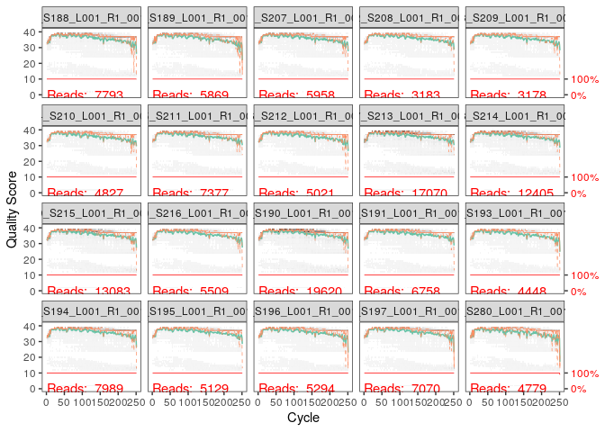
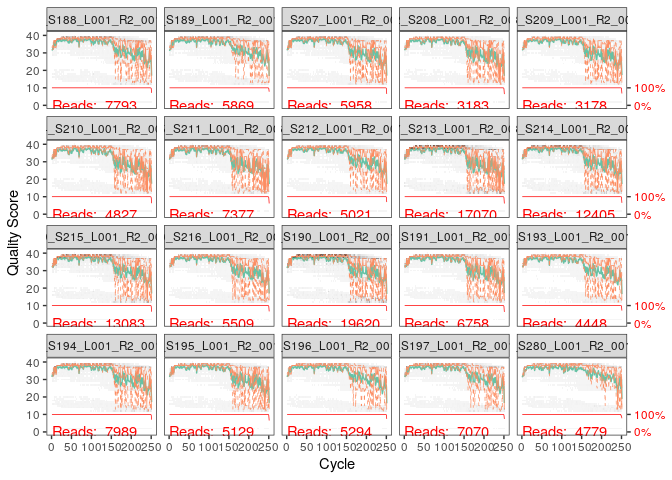
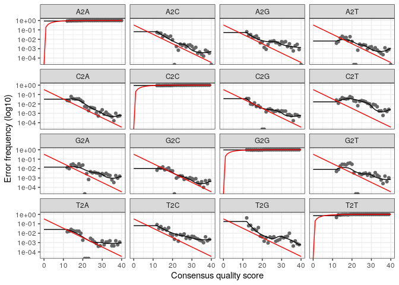
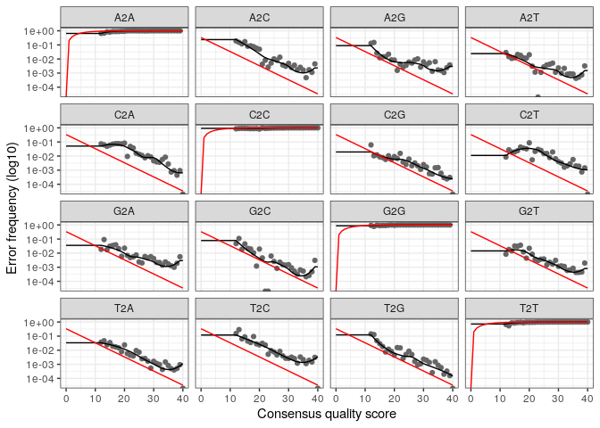
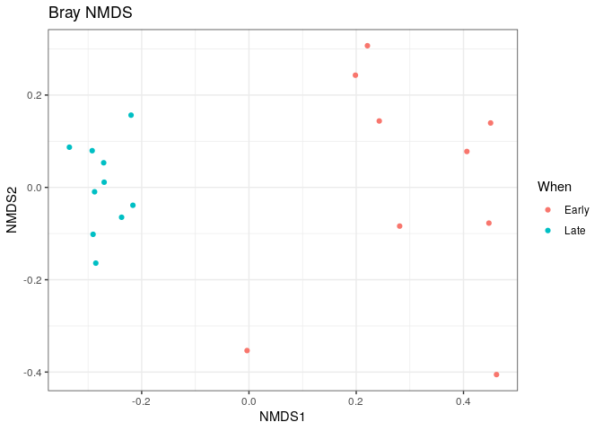

R Notebook
================

``` r
library(dada2)
```

    ## Loading required package: Rcpp

``` r
install.packages("Rcpp")
```

    ## Installing package into '/usr/local/lib/R/site-library'
    ## (as 'lib' is unspecified)

``` r
library(dada2)
packageVersion("dada2")
```

    ## [1] '1.28.0'

``` r
path<- "/home/rstudio/essai2/MiSeq_SOP"   #pour mettre les noms de fichiers dans une variable pour pouvoir l'acceder facilement apres
list.files(path)
```

    ##  [1] "F3D0_S188_L001_R1_001.fastq"   "F3D0_S188_L001_R2_001.fastq"  
    ##  [3] "F3D1_S189_L001_R1_001.fastq"   "F3D1_S189_L001_R2_001.fastq"  
    ##  [5] "F3D141_S207_L001_R1_001.fastq" "F3D141_S207_L001_R2_001.fastq"
    ##  [7] "F3D142_S208_L001_R1_001.fastq" "F3D142_S208_L001_R2_001.fastq"
    ##  [9] "F3D143_S209_L001_R1_001.fastq" "F3D143_S209_L001_R2_001.fastq"
    ## [11] "F3D144_S210_L001_R1_001.fastq" "F3D144_S210_L001_R2_001.fastq"
    ## [13] "F3D145_S211_L001_R1_001.fastq" "F3D145_S211_L001_R2_001.fastq"
    ## [15] "F3D146_S212_L001_R1_001.fastq" "F3D146_S212_L001_R2_001.fastq"
    ## [17] "F3D147_S213_L001_R1_001.fastq" "F3D147_S213_L001_R2_001.fastq"
    ## [19] "F3D148_S214_L001_R1_001.fastq" "F3D148_S214_L001_R2_001.fastq"
    ## [21] "F3D149_S215_L001_R1_001.fastq" "F3D149_S215_L001_R2_001.fastq"
    ## [23] "F3D150_S216_L001_R1_001.fastq" "F3D150_S216_L001_R2_001.fastq"
    ## [25] "F3D2_S190_L001_R1_001.fastq"   "F3D2_S190_L001_R2_001.fastq"  
    ## [27] "F3D3_S191_L001_R1_001.fastq"   "F3D3_S191_L001_R2_001.fastq"  
    ## [29] "F3D5_S193_L001_R1_001.fastq"   "F3D5_S193_L001_R2_001.fastq"  
    ## [31] "F3D6_S194_L001_R1_001.fastq"   "F3D6_S194_L001_R2_001.fastq"  
    ## [33] "F3D7_S195_L001_R1_001.fastq"   "F3D7_S195_L001_R2_001.fastq"  
    ## [35] "F3D8_S196_L001_R1_001.fastq"   "F3D8_S196_L001_R2_001.fastq"  
    ## [37] "F3D9_S197_L001_R1_001.fastq"   "F3D9_S197_L001_R2_001.fastq"  
    ## [39] "filtered"                      "HMP_MOCK.v35.fasta"           
    ## [41] "Mock_S280_L001_R1_001.fastq"   "Mock_S280_L001_R2_001.fastq"  
    ## [43] "mouse.dpw.metadata"            "mouse.time.design"            
    ## [45] "stability.batch"               "stability.files"

``` r
fnFs <- sort(list.files(path, pattern="_R1_001.fastq", full.names = TRUE))
fnRs <- sort(list.files(path, pattern="_R2_001.fastq", full.names = TRUE))
#sort = pour trier les fichiers dans un ordre alphabetique
#list files= liste les fichiers dans le chemin path
#pattern="_R1_001.fastq" pour ne selectionner que les fichiers qui sont nommés "_R1_001.fastq"
#full.names=true pour donner le chemin complet
print(fnFs)
```

    ##  [1] "/home/rstudio/essai2/MiSeq_SOP/F3D0_S188_L001_R1_001.fastq"  
    ##  [2] "/home/rstudio/essai2/MiSeq_SOP/F3D1_S189_L001_R1_001.fastq"  
    ##  [3] "/home/rstudio/essai2/MiSeq_SOP/F3D141_S207_L001_R1_001.fastq"
    ##  [4] "/home/rstudio/essai2/MiSeq_SOP/F3D142_S208_L001_R1_001.fastq"
    ##  [5] "/home/rstudio/essai2/MiSeq_SOP/F3D143_S209_L001_R1_001.fastq"
    ##  [6] "/home/rstudio/essai2/MiSeq_SOP/F3D144_S210_L001_R1_001.fastq"
    ##  [7] "/home/rstudio/essai2/MiSeq_SOP/F3D145_S211_L001_R1_001.fastq"
    ##  [8] "/home/rstudio/essai2/MiSeq_SOP/F3D146_S212_L001_R1_001.fastq"
    ##  [9] "/home/rstudio/essai2/MiSeq_SOP/F3D147_S213_L001_R1_001.fastq"
    ## [10] "/home/rstudio/essai2/MiSeq_SOP/F3D148_S214_L001_R1_001.fastq"
    ## [11] "/home/rstudio/essai2/MiSeq_SOP/F3D149_S215_L001_R1_001.fastq"
    ## [12] "/home/rstudio/essai2/MiSeq_SOP/F3D150_S216_L001_R1_001.fastq"
    ## [13] "/home/rstudio/essai2/MiSeq_SOP/F3D2_S190_L001_R1_001.fastq"  
    ## [14] "/home/rstudio/essai2/MiSeq_SOP/F3D3_S191_L001_R1_001.fastq"  
    ## [15] "/home/rstudio/essai2/MiSeq_SOP/F3D5_S193_L001_R1_001.fastq"  
    ## [16] "/home/rstudio/essai2/MiSeq_SOP/F3D6_S194_L001_R1_001.fastq"  
    ## [17] "/home/rstudio/essai2/MiSeq_SOP/F3D7_S195_L001_R1_001.fastq"  
    ## [18] "/home/rstudio/essai2/MiSeq_SOP/F3D8_S196_L001_R1_001.fastq"  
    ## [19] "/home/rstudio/essai2/MiSeq_SOP/F3D9_S197_L001_R1_001.fastq"  
    ## [20] "/home/rstudio/essai2/MiSeq_SOP/Mock_S280_L001_R1_001.fastq"

``` r
print(fnRs)
```

    ##  [1] "/home/rstudio/essai2/MiSeq_SOP/F3D0_S188_L001_R2_001.fastq"  
    ##  [2] "/home/rstudio/essai2/MiSeq_SOP/F3D1_S189_L001_R2_001.fastq"  
    ##  [3] "/home/rstudio/essai2/MiSeq_SOP/F3D141_S207_L001_R2_001.fastq"
    ##  [4] "/home/rstudio/essai2/MiSeq_SOP/F3D142_S208_L001_R2_001.fastq"
    ##  [5] "/home/rstudio/essai2/MiSeq_SOP/F3D143_S209_L001_R2_001.fastq"
    ##  [6] "/home/rstudio/essai2/MiSeq_SOP/F3D144_S210_L001_R2_001.fastq"
    ##  [7] "/home/rstudio/essai2/MiSeq_SOP/F3D145_S211_L001_R2_001.fastq"
    ##  [8] "/home/rstudio/essai2/MiSeq_SOP/F3D146_S212_L001_R2_001.fastq"
    ##  [9] "/home/rstudio/essai2/MiSeq_SOP/F3D147_S213_L001_R2_001.fastq"
    ## [10] "/home/rstudio/essai2/MiSeq_SOP/F3D148_S214_L001_R2_001.fastq"
    ## [11] "/home/rstudio/essai2/MiSeq_SOP/F3D149_S215_L001_R2_001.fastq"
    ## [12] "/home/rstudio/essai2/MiSeq_SOP/F3D150_S216_L001_R2_001.fastq"
    ## [13] "/home/rstudio/essai2/MiSeq_SOP/F3D2_S190_L001_R2_001.fastq"  
    ## [14] "/home/rstudio/essai2/MiSeq_SOP/F3D3_S191_L001_R2_001.fastq"  
    ## [15] "/home/rstudio/essai2/MiSeq_SOP/F3D5_S193_L001_R2_001.fastq"  
    ## [16] "/home/rstudio/essai2/MiSeq_SOP/F3D6_S194_L001_R2_001.fastq"  
    ## [17] "/home/rstudio/essai2/MiSeq_SOP/F3D7_S195_L001_R2_001.fastq"  
    ## [18] "/home/rstudio/essai2/MiSeq_SOP/F3D8_S196_L001_R2_001.fastq"  
    ## [19] "/home/rstudio/essai2/MiSeq_SOP/F3D9_S197_L001_R2_001.fastq"  
    ## [20] "/home/rstudio/essai2/MiSeq_SOP/Mock_S280_L001_R2_001.fastq"

``` r
sample.names <- sapply(strsplit(basename(fnFs), "_"), `[`, 1)

#basename= extraction du nom de fichier sans le chemin complet depuis la variable Fnfs qui contient les fichiers avec leur chemins
#strsplit(,'_')= pour diviser les noms des fichiers et ne prendre que la partie qui est en amont de '_'
#sapply(,[,1)= applique la fonction d'extraction ([ ) pour prendre la premiere partie de chaque nom de fichiers avant le '_'
print(sample.names)
```

    ##  [1] "F3D0"   "F3D1"   "F3D141" "F3D142" "F3D143" "F3D144" "F3D145" "F3D146"
    ##  [9] "F3D147" "F3D148" "F3D149" "F3D150" "F3D2"   "F3D3"   "F3D5"   "F3D6"  
    ## [17] "F3D7"   "F3D8"   "F3D9"   "Mock"

``` r
plotQualityProfile(fnFs[1:20])
```

<!-- -->

``` r
plotQualityProfile(fnRs[1:20])
```

<!-- -->

``` r
#pour visualiser la qualité de lecture des fichiers Fastq
#ca va generer une visualisation de la qualité des sequences pour ces fichiers et cela est utile pour determiner les positions ou la qulaite baisse afin de decider d'ou commencer le trimming des lectures
```

``` r
filtFs <- file.path(path, "filtered", paste0(sample.names, "_F_filt.fastq.gz"))
filtRs <- file.path(path, "filtered", paste0(sample.names, "_R_filt.fastq.gz"))
names(filtFs) <- sample.names
names(filtRs) <- sample.names
print(filtFs)
```

    ##                                                             F3D0 
    ##   "/home/rstudio/essai2/MiSeq_SOP/filtered/F3D0_F_filt.fastq.gz" 
    ##                                                             F3D1 
    ##   "/home/rstudio/essai2/MiSeq_SOP/filtered/F3D1_F_filt.fastq.gz" 
    ##                                                           F3D141 
    ## "/home/rstudio/essai2/MiSeq_SOP/filtered/F3D141_F_filt.fastq.gz" 
    ##                                                           F3D142 
    ## "/home/rstudio/essai2/MiSeq_SOP/filtered/F3D142_F_filt.fastq.gz" 
    ##                                                           F3D143 
    ## "/home/rstudio/essai2/MiSeq_SOP/filtered/F3D143_F_filt.fastq.gz" 
    ##                                                           F3D144 
    ## "/home/rstudio/essai2/MiSeq_SOP/filtered/F3D144_F_filt.fastq.gz" 
    ##                                                           F3D145 
    ## "/home/rstudio/essai2/MiSeq_SOP/filtered/F3D145_F_filt.fastq.gz" 
    ##                                                           F3D146 
    ## "/home/rstudio/essai2/MiSeq_SOP/filtered/F3D146_F_filt.fastq.gz" 
    ##                                                           F3D147 
    ## "/home/rstudio/essai2/MiSeq_SOP/filtered/F3D147_F_filt.fastq.gz" 
    ##                                                           F3D148 
    ## "/home/rstudio/essai2/MiSeq_SOP/filtered/F3D148_F_filt.fastq.gz" 
    ##                                                           F3D149 
    ## "/home/rstudio/essai2/MiSeq_SOP/filtered/F3D149_F_filt.fastq.gz" 
    ##                                                           F3D150 
    ## "/home/rstudio/essai2/MiSeq_SOP/filtered/F3D150_F_filt.fastq.gz" 
    ##                                                             F3D2 
    ##   "/home/rstudio/essai2/MiSeq_SOP/filtered/F3D2_F_filt.fastq.gz" 
    ##                                                             F3D3 
    ##   "/home/rstudio/essai2/MiSeq_SOP/filtered/F3D3_F_filt.fastq.gz" 
    ##                                                             F3D5 
    ##   "/home/rstudio/essai2/MiSeq_SOP/filtered/F3D5_F_filt.fastq.gz" 
    ##                                                             F3D6 
    ##   "/home/rstudio/essai2/MiSeq_SOP/filtered/F3D6_F_filt.fastq.gz" 
    ##                                                             F3D7 
    ##   "/home/rstudio/essai2/MiSeq_SOP/filtered/F3D7_F_filt.fastq.gz" 
    ##                                                             F3D8 
    ##   "/home/rstudio/essai2/MiSeq_SOP/filtered/F3D8_F_filt.fastq.gz" 
    ##                                                             F3D9 
    ##   "/home/rstudio/essai2/MiSeq_SOP/filtered/F3D9_F_filt.fastq.gz" 
    ##                                                             Mock 
    ##   "/home/rstudio/essai2/MiSeq_SOP/filtered/Mock_F_filt.fastq.gz"

``` r
print(filtRs)
```

    ##                                                             F3D0 
    ##   "/home/rstudio/essai2/MiSeq_SOP/filtered/F3D0_R_filt.fastq.gz" 
    ##                                                             F3D1 
    ##   "/home/rstudio/essai2/MiSeq_SOP/filtered/F3D1_R_filt.fastq.gz" 
    ##                                                           F3D141 
    ## "/home/rstudio/essai2/MiSeq_SOP/filtered/F3D141_R_filt.fastq.gz" 
    ##                                                           F3D142 
    ## "/home/rstudio/essai2/MiSeq_SOP/filtered/F3D142_R_filt.fastq.gz" 
    ##                                                           F3D143 
    ## "/home/rstudio/essai2/MiSeq_SOP/filtered/F3D143_R_filt.fastq.gz" 
    ##                                                           F3D144 
    ## "/home/rstudio/essai2/MiSeq_SOP/filtered/F3D144_R_filt.fastq.gz" 
    ##                                                           F3D145 
    ## "/home/rstudio/essai2/MiSeq_SOP/filtered/F3D145_R_filt.fastq.gz" 
    ##                                                           F3D146 
    ## "/home/rstudio/essai2/MiSeq_SOP/filtered/F3D146_R_filt.fastq.gz" 
    ##                                                           F3D147 
    ## "/home/rstudio/essai2/MiSeq_SOP/filtered/F3D147_R_filt.fastq.gz" 
    ##                                                           F3D148 
    ## "/home/rstudio/essai2/MiSeq_SOP/filtered/F3D148_R_filt.fastq.gz" 
    ##                                                           F3D149 
    ## "/home/rstudio/essai2/MiSeq_SOP/filtered/F3D149_R_filt.fastq.gz" 
    ##                                                           F3D150 
    ## "/home/rstudio/essai2/MiSeq_SOP/filtered/F3D150_R_filt.fastq.gz" 
    ##                                                             F3D2 
    ##   "/home/rstudio/essai2/MiSeq_SOP/filtered/F3D2_R_filt.fastq.gz" 
    ##                                                             F3D3 
    ##   "/home/rstudio/essai2/MiSeq_SOP/filtered/F3D3_R_filt.fastq.gz" 
    ##                                                             F3D5 
    ##   "/home/rstudio/essai2/MiSeq_SOP/filtered/F3D5_R_filt.fastq.gz" 
    ##                                                             F3D6 
    ##   "/home/rstudio/essai2/MiSeq_SOP/filtered/F3D6_R_filt.fastq.gz" 
    ##                                                             F3D7 
    ##   "/home/rstudio/essai2/MiSeq_SOP/filtered/F3D7_R_filt.fastq.gz" 
    ##                                                             F3D8 
    ##   "/home/rstudio/essai2/MiSeq_SOP/filtered/F3D8_R_filt.fastq.gz" 
    ##                                                             F3D9 
    ##   "/home/rstudio/essai2/MiSeq_SOP/filtered/F3D9_R_filt.fastq.gz" 
    ##                                                             Mock 
    ##   "/home/rstudio/essai2/MiSeq_SOP/filtered/Mock_R_filt.fastq.gz"

``` r
#ici on est juste en train de prparer les fichiers de sortie pour les lectures forward et reverse apres le filtrage des sequence
#file.path(path,"filtered",)= cest pour creer un chemin pour les fichiers de sortie dans un sous dossier appellé filtered
#paste0(sample.names, "_F_filt.fastq.gz") cela va creer les noms de fichiers de sortie pour chaque echantillon en ajoutant le suffixe _F_filt.fastq.gz pour les lectures forward et meme truc pour les fichiers reverse
#names(filtFs)<- sample.names cette etape va associer les noms des echantillons aux noms des fichiers filtres respectifs
#avant filtrage  F3D0
#apres filtrage F3D0 
  "/home/rstudio/essai2/MiSeq_SOP/filtered/F3D0_F_filt.fastq.gz" 
```

    ## [1] "/home/rstudio/essai2/MiSeq_SOP/filtered/F3D0_F_filt.fastq.gz"

``` r
out <- filterAndTrim(fnFs, filtFs, fnRs, filtRs, truncLen=c(240,160),
              maxN=0, maxEE=c(2,2), truncQ=2, rm.phix=TRUE,
              compress=TRUE, multithread=TRUE)
#filterAndTrim() fonction de dada2 qui va filtrer et tronquer les sequences forward et reverse selon leurs qualite
#fnFs,filtFs = les chemins vers les fichiers de sequence forward avant et apres le filtrage
#fnRs,filtRs les chemins vers les fichiers de sequences reverse avant et apres le filtrage
#truncLen=c(240,160)= specifie la longeur a laquelle on veut tronquer les sequences ,,,,, pour les sequence forwrd elles vont etre tronquer a 240 bases et pour les sequences reverse elles vont etre tronquer a 140 bases 
#cela va aider a eliminer les bases de faible qualité
#maxN=0 va eliminer toutes les sequences qui contiennent des nucleotides ambigues N donc on va se debarasser de toutes les sequences qui contiennent un N
#maxEE=c(2,2)= cela va definier le nombre maximum d'erreur attendes (maximum number of expected errors)
#pour les sequence forwrad et reverse le seuil d'erreurs est fixe a 2 erreurs max donc si la sequence contient plus q"une erreur elle va etre filtré
#truncQ=2 cette instruction va tronquer les sequences si la qualité moyenne descend en dessous de 2 vers la fin
#rm.phix= va retirer toutes les seqeunces de PhiX qui est un controle commun dans les donnes de sequencage illumina
#compress=TRUE pour compresser les fichiers en formar .fastq.gz pour economiser de l'espace
#multithread=True pour utiliser plusieurs serveurs a la fois

print(out)
```

    ##                               reads.in reads.out
    ## F3D0_S188_L001_R1_001.fastq       7793      7113
    ## F3D1_S189_L001_R1_001.fastq       5869      5299
    ## F3D141_S207_L001_R1_001.fastq     5958      5463
    ## F3D142_S208_L001_R1_001.fastq     3183      2914
    ## F3D143_S209_L001_R1_001.fastq     3178      2941
    ## F3D144_S210_L001_R1_001.fastq     4827      4312
    ## F3D145_S211_L001_R1_001.fastq     7377      6741
    ## F3D146_S212_L001_R1_001.fastq     5021      4560
    ## F3D147_S213_L001_R1_001.fastq    17070     15637
    ## F3D148_S214_L001_R1_001.fastq    12405     11413
    ## F3D149_S215_L001_R1_001.fastq    13083     12017
    ## F3D150_S216_L001_R1_001.fastq     5509      5032
    ## F3D2_S190_L001_R1_001.fastq      19620     18075
    ## F3D3_S191_L001_R1_001.fastq       6758      6250
    ## F3D5_S193_L001_R1_001.fastq       4448      4052
    ## F3D6_S194_L001_R1_001.fastq       7989      7369
    ## F3D7_S195_L001_R1_001.fastq       5129      4765
    ## F3D8_S196_L001_R1_001.fastq       5294      4871
    ## F3D9_S197_L001_R1_001.fastq       7070      6504
    ## Mock_S280_L001_R1_001.fastq       4779      4314

``` r
head(out)
```

    ##                               reads.in reads.out
    ## F3D0_S188_L001_R1_001.fastq       7793      7113
    ## F3D1_S189_L001_R1_001.fastq       5869      5299
    ## F3D141_S207_L001_R1_001.fastq     5958      5463
    ## F3D142_S208_L001_R1_001.fastq     3183      2914
    ## F3D143_S209_L001_R1_001.fastq     3178      2941
    ## F3D144_S210_L001_R1_001.fastq     4827      4312

``` r
errF <- learnErrors(filtFs, multithread=TRUE)
```

    ## 33514080 total bases in 139642 reads from 20 samples will be used for learning the error rates.

``` r
#learnErrors est la fonction de dada2 qui va generer un modele d'erreurs a partir des seqeunces filtrees (contenues dans la variable filtFs)
```

``` r
errR <- learnErrors(filtRs, multithread=TRUE)
```

    ## 22342720 total bases in 139642 reads from 20 samples will be used for learning the error rates.

``` r
plotErrors(errF, nominalQ=TRUE)
```

    ## Warning: Transformation introduced infinite values in continuous y-axis
    ## Transformation introduced infinite values in continuous y-axis

<!-- -->

``` r
#cette fonction va nous donner une visualisation de modele d'erreurs appris par le dada2 apartir des sequences filtrees

#courbe rouge= indique le taux d'erreurs attendus en fonction des scores de qulaité 


#points noirs= represente le taux d'erreurs observe dans les donnees filtrés ,,, chaque point represente un taux d'erreur pour une certaine base et son qscore,,, la taux d'erreur observé est la proportion de bases mal appeles par rapport aux bases réellement sequencées  #ces points representent les erreurs effectivement rencontrées dans les lectures filtrés


#courbe noir= indique le modele d'erreur appris a partir des donnes,, cette courbe modelise la probabilté qu"une base soit mal placée en fonction de Qscore, ce modele doit suivre les points noirs 


#si le graphique montre une bonne correspondance entre les erreurs observées et le modele appris ca veut dire quil'est bien

plotErrors(errR, nominalQ=TRUE)
```

    ## Warning: Transformation introduced infinite values in continuous y-axis
    ## Transformation introduced infinite values in continuous y-axis

<!-- -->

``` r
dadaFs <- dada(filtFs, err=errF, multithread=TRUE)
```

    ## Sample 1 - 7113 reads in 1979 unique sequences.
    ## Sample 2 - 5299 reads in 1639 unique sequences.
    ## Sample 3 - 5463 reads in 1477 unique sequences.
    ## Sample 4 - 2914 reads in 904 unique sequences.
    ## Sample 5 - 2941 reads in 939 unique sequences.
    ## Sample 6 - 4312 reads in 1267 unique sequences.
    ## Sample 7 - 6741 reads in 1756 unique sequences.
    ## Sample 8 - 4560 reads in 1438 unique sequences.
    ## Sample 9 - 15637 reads in 3590 unique sequences.
    ## Sample 10 - 11413 reads in 2762 unique sequences.
    ## Sample 11 - 12017 reads in 3021 unique sequences.
    ## Sample 12 - 5032 reads in 1566 unique sequences.
    ## Sample 13 - 18075 reads in 3707 unique sequences.
    ## Sample 14 - 6250 reads in 1479 unique sequences.
    ## Sample 15 - 4052 reads in 1195 unique sequences.
    ## Sample 16 - 7369 reads in 1832 unique sequences.
    ## Sample 17 - 4765 reads in 1183 unique sequences.
    ## Sample 18 - 4871 reads in 1382 unique sequences.
    ## Sample 19 - 6504 reads in 1709 unique sequences.
    ## Sample 20 - 4314 reads in 897 unique sequences.

``` r
#cette fonction va effectuer la correction des seq filtrees en utilisant le modele d'erreurs 
#filtFs cela est pr appler les sequences filtrees
#err=errF et cela fait reference au modele d'erreurs que a dada2 a deja genere avec learnerrors
###en passant le modele d'erreur a la fonction dada cela va permettre a dada2 de corriger les errurs de sequencage en se basant sur ce modele
#la fonction dada()= identifie les seq d'origine a partir des seq filtrees en se basant sur le modele d'erreurs et pour chaque seq elle va tenter de determiner ce qui est seq reelle et ce qui est erreur de sequencage
```

``` r
dadaRs <- dada(filtRs, err=errR, multithread=TRUE)
```

    ## Sample 1 - 7113 reads in 1660 unique sequences.
    ## Sample 2 - 5299 reads in 1349 unique sequences.
    ## Sample 3 - 5463 reads in 1335 unique sequences.
    ## Sample 4 - 2914 reads in 853 unique sequences.
    ## Sample 5 - 2941 reads in 880 unique sequences.
    ## Sample 6 - 4312 reads in 1286 unique sequences.
    ## Sample 7 - 6741 reads in 1803 unique sequences.
    ## Sample 8 - 4560 reads in 1265 unique sequences.
    ## Sample 9 - 15637 reads in 3414 unique sequences.
    ## Sample 10 - 11413 reads in 2522 unique sequences.
    ## Sample 11 - 12017 reads in 2771 unique sequences.
    ## Sample 12 - 5032 reads in 1415 unique sequences.
    ## Sample 13 - 18075 reads in 3290 unique sequences.
    ## Sample 14 - 6250 reads in 1390 unique sequences.
    ## Sample 15 - 4052 reads in 1134 unique sequences.
    ## Sample 16 - 7369 reads in 1635 unique sequences.
    ## Sample 17 - 4765 reads in 1084 unique sequences.
    ## Sample 18 - 4871 reads in 1161 unique sequences.
    ## Sample 19 - 6504 reads in 1502 unique sequences.
    ## Sample 20 - 4314 reads in 732 unique sequences.

``` r
dadaFs[[3]]
```

    ## dada-class: object describing DADA2 denoising results
    ## 97 sequence variants were inferred from 1477 input unique sequences.
    ## Key parameters: OMEGA_A = 1e-40, OMEGA_C = 1e-40, BAND_SIZE = 16

``` r
#cette instruction va nous afficher le 3eme element de la table dadaFs qui contient les resultats de debruitage

#resultats:
# dadaclass= notre objet est une instance de la classe dada qui est utilise par le DADA2 pour stocker le resultats de debruitage
#97 sequences variantes veut dire que dadA2 a trouvé 97 sequences variantes qu'il considere comme des representation biologiques réelles
#1477 input sequences cela veut dire que dada2 a recu 1477 seqeunces uniques comme entree avant le debruitage

#OMEGA_A = 1e-40 et #OMEGA_C = 1e-40 ces valeurs representent le taux d'erreurs estime pour les substitustions de A et C dans les sequences les valeurs sont tres faibles donc dada2 estime que ces erreurs sont tres rares
#cela indique que le modele d'erreur a ete ajuste pour considerer que les erruers de substitutions des bases A et C sont peu probables
```

``` r
mergers <- mergePairs(dadaFs, filtFs, dadaRs, filtRs, verbose=TRUE)
```

    ## 6540 paired-reads (in 107 unique pairings) successfully merged out of 6891 (in 197 pairings) input.

    ## 5028 paired-reads (in 101 unique pairings) successfully merged out of 5190 (in 157 pairings) input.

    ## 4986 paired-reads (in 81 unique pairings) successfully merged out of 5267 (in 166 pairings) input.

    ## 2595 paired-reads (in 52 unique pairings) successfully merged out of 2754 (in 108 pairings) input.

    ## 2553 paired-reads (in 60 unique pairings) successfully merged out of 2785 (in 119 pairings) input.

    ## 3646 paired-reads (in 55 unique pairings) successfully merged out of 4109 (in 157 pairings) input.

    ## 6079 paired-reads (in 81 unique pairings) successfully merged out of 6514 (in 198 pairings) input.

    ## 3968 paired-reads (in 91 unique pairings) successfully merged out of 4388 (in 187 pairings) input.

    ## 14233 paired-reads (in 143 unique pairings) successfully merged out of 15355 (in 352 pairings) input.

    ## 10528 paired-reads (in 120 unique pairings) successfully merged out of 11165 (in 278 pairings) input.

    ## 11154 paired-reads (in 137 unique pairings) successfully merged out of 11797 (in 298 pairings) input.

    ## 4349 paired-reads (in 85 unique pairings) successfully merged out of 4802 (in 179 pairings) input.

    ## 17431 paired-reads (in 153 unique pairings) successfully merged out of 17812 (in 272 pairings) input.

    ## 5850 paired-reads (in 81 unique pairings) successfully merged out of 6095 (in 159 pairings) input.

    ## 3716 paired-reads (in 86 unique pairings) successfully merged out of 3894 (in 147 pairings) input.

    ## 6865 paired-reads (in 99 unique pairings) successfully merged out of 7191 (in 187 pairings) input.

    ## 4426 paired-reads (in 67 unique pairings) successfully merged out of 4603 (in 127 pairings) input.

    ## 4576 paired-reads (in 101 unique pairings) successfully merged out of 4739 (in 174 pairings) input.

    ## 6092 paired-reads (in 109 unique pairings) successfully merged out of 6315 (in 173 pairings) input.

    ## 4269 paired-reads (in 20 unique pairings) successfully merged out of 4281 (in 28 pairings) input.

``` r
#cette instruction et pour fusionner les sequences R1 et R2 pour obtenir les sequences finales completes
#cette fonction utilise un algorithme basé sur le chevauchement pour creer des sequences completes
#elle calcule le nombre de seq qui ont ete fusionne avec succes et celles qui n'ont pas ete fusionnes
#les lectures qui ne se chevauchent pas correctement ne seront pas fusionnes
#resultats: 6540 paired-reads (in 107 unique pairings) successfully merged out of 6891 (in 197 pairings) input.>>> 6540/6891 paires de lectures cad forward et reverse ont ete mergées correctement,,,, et 107 varaints cad combinaisons qui ont ete obtenues a la fin de fusion 
head(mergers[[3]])
```

    ##                                                                                                                                                                                                                                                        sequence
    ## 1  TACGGAGGATGCGAGCGTTATCCGGATTTATTGGGTTTAAAGGGTGCGTAGGCGGGCTTTTAAGTCAGCGGTAAAAATTCGGGGCTCAACCCCGTCCGGCCGTTGAAACTGGGGGCCTTGAGTGGGCGAGAAGAAGGCGGAATGCGTGGTGTAGCGGTGAAATGCATAGATATCACGCAGAACCCCGATTGCGAAGGCAGCCTTCCGGCGCCCTACTGACGCTGAGGCACGAAAGTGCGGGGATCGAACAGG
    ## 2  TACGGAGGATGCGAGCGTTATCCGGATTTATTGGGTTTAAAGGGTGCGCAGGCGGAAGATCAAGTCAGCGGTAAAATTGAGAGGCTCAACCTCTTCGAGCCGTTGAAACTGGTTTTCTTGAGTGAGCGAGAAGTATGCGGAATGCGTGGTGTAGCGGTGAAATGCATAGATATCACGCAGAACTCCGATTGCGAAGGCAGCATACCGGCGCTCAACTGACGCTCATGCACGAAAGTGTGGGTATCGAACAGG
    ## 3  TACGGAGGATGCGAGCGTTATCCGGATTTATTGGGTTTAAAGGGTGCGCAGGCGGACTCTCAAGTCAGCGGTCAAATCGCGGGGCTCAACCCCGTTCCGCCGTTGAAACTGGGAGCCTTGAGTGCGCGAGAAGTAGGCGGAATGCGTGGTGTAGCGGTGAAATGCATAGATATCACGCAGAACTCCGATTGCGAAGGCAGCCTACCGGCGCGCAACTGACGCTCATGCACGAAAGCGTGGGTATCGAACAGG
    ## 4  TACGGAGGATGCGAGCGTTATCCGGATTTATTGGGTTTAAAGGGTGCGTAGGCGGGCTGTTAAGTCAGCGGTCAAATGTCGGGGCTCAACCCCGGCCTGCCGTTGAAACTGGCGGCCTCGAGTGGGCGAGAAGTATGCGGAATGCGTGGTGTAGCGGTGAAATGCATAGATATCACGCAGAACTCCGATTGCGAAGGCAGCATACCGGCGCCCGACTGACGCTGAGGCACGAAAGCGTGGGTATCGAACAGG
    ## 5  TACGGAGGATGCGAGCGTTATCCGGATTTATTGGGTTTAAAGGGTGCGTAGGCGGCCTGCCAAGTCAGCGGTAAAATTGCGGGGCTCAACCCCGTACAGCCGTTGAAACTGCCGGGCTCGAGTGGGCGAGAAGTATGCGGAATGCGTGGTGTAGCGGTGAAATGCATAGATATCACGCAGAACCCCGATTGCGAAGGCAGCATACCGGCGCCCTACTGACGCTGAGGCACGAAAGTGCGGGGATCAAACAGG
    ## 6 TACGGAGGATTCAAGCGTTATCCGGATTTATTGGGTTTAAAGGGTGCGTAGGCGGTTCGATAAGTTAGAGGTGAAATCCCGGGGCTCAACTCCGGCACTGCCTCTGATACTGTCGGGCTAGAGTTTAGTTGCGGTAGGCGGAATGTATGGTGTAGCGGTGAAATGCATAGAGATCATACAGAACACCGATTGCGAAGGCAGCTTACCAAACTACGACTGACGTTGAGGCACGAAAGCGTGGGGAGCAAACAGG
    ##   abundance forward reverse nmatch nmismatch nindel prefer accept
    ## 1       502       1       1    148         0      0      2   TRUE
    ## 2       444       2       2    148         0      0      1   TRUE
    ## 3       362       3       4    148         0      0      1   TRUE
    ## 4       345       4       6    148         0      0      1   TRUE
    ## 5       331       6       5    148         0      0      1   TRUE
    ## 6       321       5       3    147         0      0      2   TRUE

``` r
seqtab <- makeSequenceTable(mergers)  #pour creer une table des sequences fusionnes
dim(seqtab)
```

    ## [1]  20 293

``` r
table(nchar(getSequences(seqtab))) 
```

    ## 
    ## 251 252 253 254 255 
    ##   1  88 196   6   2

``` r
#getSequences() pour extraire toutes les seq uniques de notre tableau de sequences et elle renvoie un vecteur contenant toutes les sequences sous forme de chaine de caracteres
#nchar() cette fonction calcule la taille de chaque sequence dans le vecteur obtenu par getSequences et elle renvoie un vecteur numerique
#table() cette fonction va creer une table de frequence qui va contenir le nombre de seq qui ont une certaine longeur donc elle va compter le nombre de seq selon leur taille
#une sequence est de taille 251,,, 88 sequences sont de taille de 252
```

``` r
seqtab.nochim <- removeBimeraDenovo(seqtab, method="consensus", multithread=TRUE, verbose=TRUE)  #pour eliminer les chimere
```

    ## Identified 61 bimeras out of 293 input sequences.

``` r
#les chimere sont les seq qui ont ete merger incorrectement
#seqtab contient toutes les seq uniques(variantes
#method=consensus >>> pour specifier que la methode consensus sera utiliser pour eliminer les chimeres
#comment cet algorithme reconnait les chimeres? il va en prmier lieu tente de reconstruire des chimeres de ref en se basant sur les seq parentales puis il va comparer ces chimeres avec les sequences obtenues apres fusion et si une sequence est similaire a la seq chimere de ref il va la considerer comme chimere et l'eliminer
#cet algorithme va utiliser donc une methode de consensus pour determiner si la seq suspecte correspond a une chimere en verifiant la presence de segements de sequences parentales
#verbose=TRUE pour afficer les messages detailles pendant le traitement
dim(seqtab.nochim)
```

    ## [1]  20 232

``` r
#print(seqtab.nochim)
```

``` r
sum(seqtab.nochim)/sum(seqtab)
```

    ## [1] 0.9640374

``` r
#96.40% des seq ont ete conserve apres l'elimination des chimeres
```

``` r
getN <- function(x) sum(getUniques(x))
#avec cette fonction on va prendre un objet de DADA2 (dans ce cas je pense c'est seqtab.nochim) et elle va calculer le nombre total de sequences uniques et sum(getUniques(x)) va calculer le nbr d'occurrence des seq uniques dans ce tableau

track <- cbind(out, sapply(dadaFs, getN), sapply(dadaRs, getN), sapply(mergers, getN), rowSums(seqtab.nochim))
#cbind va combiner nos vecteurs et matrices en colonnes et dans ce vas elle va assembler tout les resultats en un seul tableau
#out contient les seq d'entree
#sapply(dadaFs, getN) va appliquer la fonction getN sur chaque element de dadaFs produisant un vecteur qui comprend lenombre de seq sebruitetées
#sapply(mergers, getN) calcule le nbr de seq obtenues apres la fusion des forwards et des reverse
#rowSums(seqtab.nochim)) calcule le total des occurrences de sequences uniques apres supression des chimeres

colnames(track) <- c("input", "filtered", "denoisedF", "denoisedR", "merged", "nonchim")
#input >>> le nombre de sequences d'entree bruutes
#filtered >>> le nombre de sequences apres filtrages
#denoisedF >> nombre de sequences debruites forwared
#denoisedR >>> nombre de seq debruites reverse
#merged >>> nombre de seq fusionnes avec succes
#nochim >>> nombre de seq apres elimination des chimeres
rownames(track) <- sample.names
head(track)
```

    ##        input filtered denoisedF denoisedR merged nonchim
    ## F3D0    7793     7113      6976      6979   6540    6528
    ## F3D1    5869     5299      5227      5239   5028    5017
    ## F3D141  5958     5463      5331      5357   4986    4863
    ## F3D142  3183     2914      2799      2830   2595    2521
    ## F3D143  3178     2941      2822      2868   2553    2519
    ## F3D144  4827     4312      4151      4228   3646    3507

``` r
taxa <- assignTaxonomy(seqtab.nochim, "/home/rstudio/essai2/silva_nr_v132_train_set.fa.gz?download=1", multithread=TRUE)
#le chemin mentionne fait reference a un fichier de ref qui contient les sequences d'adn avec leurs identites taxonomiques associes et dans ce cas il s'agit de la base de donnes silva version 132 
#assignTaxonomy >>> cette fonction va commencer par faire un alignement de notre sequences contenues dans la table seqtab.nochim avec les seq contenues dans la base de donnes de ref SILVA
#Puis elle va atttribuer des identites taxonomiques selon l'alignement
```

``` r
taxa.print <- taxa # Removing sequence rownames for display only
rownames(taxa.print) <- NULL   #suppression des identifiants des seq pour une meilleure visualisation de tableau
head(taxa.print)
```

    ##      Kingdom    Phylum          Class         Order           Family          
    ## [1,] "Bacteria" "Bacteroidetes" "Bacteroidia" "Bacteroidales" "Muribaculaceae"
    ## [2,] "Bacteria" "Bacteroidetes" "Bacteroidia" "Bacteroidales" "Muribaculaceae"
    ## [3,] "Bacteria" "Bacteroidetes" "Bacteroidia" "Bacteroidales" "Muribaculaceae"
    ## [4,] "Bacteria" "Bacteroidetes" "Bacteroidia" "Bacteroidales" "Muribaculaceae"
    ## [5,] "Bacteria" "Bacteroidetes" "Bacteroidia" "Bacteroidales" "Bacteroidaceae"
    ## [6,] "Bacteria" "Bacteroidetes" "Bacteroidia" "Bacteroidales" "Muribaculaceae"
    ##      Genus        
    ## [1,] NA           
    ## [2,] NA           
    ## [3,] NA           
    ## [4,] NA           
    ## [5,] "Bacteroides"
    ## [6,] NA

``` r
unqs.mock <- seqtab.nochim["Mock",]
#cette ligne va extraire toutes les seq uniques qui sont qssocies a l'echantillon nommé 'Mock' donc le vecteur va contenir le nombre d'occurence des seq unique dans cet echantillon
unqs.mock <- sort(unqs.mock[unqs.mock>0], decreasing=TRUE) 
#on va faire une sorte de tri? pour eliminer toutes les seq qui ne sont pas presentes dans l'echantillon et de conserver seulement les seq qui sont presentes dans cet echnatillon 
#sort va trier les sequences uniques selon leur nbr d'occurrence et donc selon leur abondance par ordre decroissant

cat("DADA2 inferred", length(unqs.mock), "sample sequences present in the Mock community.\n")
```

    ## DADA2 inferred 20 sample sequences present in the Mock community.

``` r
#cat est pour afficher les messages informatifs dans la console et length() donne combien de seq uniques ont ete recuperees de l'echantillon mock
```

``` r
mock.ref <- getSequences(file.path(path, "HMP_MOCK.v35.fasta"))
#exctraction des seq contenues dans le fichier HMP MOCK 
#mock.ref va contenir des seq de ref pour les seq mock
match.ref <- sum(sapply(names(unqs.mock), function(x) any(grepl(x, mock.ref))))
#comparaison entre les unqs mock et les mockref puis il additionne le nombre total des seq uniques dans unqs mock qui ont ete trouvées dans mockref
cat("Of those,", sum(match.ref), "were exact matches to the expected reference sequences.\n")
```

    ## Of those, 20 were exact matches to the expected reference sequences.

``` r
library(phyloseq); packageVersion("phyloseq")
```

    ## [1] '1.44.0'

``` r
library(Biostrings); packageVersion("Biostrings")
```

    ## Loading required package: BiocGenerics

    ## 
    ## Attaching package: 'BiocGenerics'

    ## The following objects are masked from 'package:stats':
    ## 
    ##     IQR, mad, sd, var, xtabs

    ## The following objects are masked from 'package:base':
    ## 
    ##     anyDuplicated, aperm, append, as.data.frame, basename, cbind,
    ##     colnames, dirname, do.call, duplicated, eval, evalq, Filter, Find,
    ##     get, grep, grepl, intersect, is.unsorted, lapply, Map, mapply,
    ##     match, mget, order, paste, pmax, pmax.int, pmin, pmin.int,
    ##     Position, rank, rbind, Reduce, rownames, sapply, setdiff, sort,
    ##     table, tapply, union, unique, unsplit, which.max, which.min

    ## Loading required package: S4Vectors

    ## Loading required package: stats4

    ## 
    ## Attaching package: 'S4Vectors'

    ## The following object is masked from 'package:utils':
    ## 
    ##     findMatches

    ## The following objects are masked from 'package:base':
    ## 
    ##     expand.grid, I, unname

    ## Loading required package: IRanges

    ## 
    ## Attaching package: 'IRanges'

    ## The following object is masked from 'package:phyloseq':
    ## 
    ##     distance

    ## Loading required package: XVector

    ## Loading required package: GenomeInfoDb

    ## 
    ## Attaching package: 'Biostrings'

    ## The following object is masked from 'package:base':
    ## 
    ##     strsplit

    ## [1] '2.68.1'

``` r
library(ggplot2); packageVersion("ggplot2")
```

    ## [1] '3.4.3'

``` r
theme_set(theme_bw())
```

``` r
samples.out <- rownames(seqtab.nochim)
#extraction des noms des echnatillons a partir de tableau seqtab.nochim

subject <- sapply(strsplit(samples.out, "D"), `[`, 1)
#on va diviser le nom de chaque echantillon par la lettre D 
#sapply va appliquer ces instructions de chaque element de samples.out

gender <- substr(subject,1,1)
#extraction du premier caractere de chaque nom d'echantillon pour detrminer le genre 

subject <- substr(subject,2,999)
#ici on va eliminer le prmier caracter de chaque nom de fichier et ne garder que le numero

day <- as.integer(sapply(strsplit(samples.out, "D"), `[`, 2))
# cette instruction va extraire la deuxieme partie donc la partie qui vient apres le D et cette deuxieme partie va etre le nombre de jours


samdf <- data.frame(Subject=subject, Gender=gender, Day=day)
#creation d'une dataframe contenant le sujet le genre et le jour

samdf$When <- "Early"
#on crée une colonne When et initialement la colonne when de samdf ne contient que early  

samdf$When[samdf$Day>100] <- "Late"
#ensuite les echantillons ou Day est superieur a 100 on leur affectent Late

rownames(samdf) <- samples.out
print(samdf)
```

    ##        Subject Gender Day  When
    ## F3D0         3      F   0 Early
    ## F3D1         3      F   1 Early
    ## F3D141       3      F 141  Late
    ## F3D142       3      F 142  Late
    ## F3D143       3      F 143  Late
    ## F3D144       3      F 144  Late
    ## F3D145       3      F 145  Late
    ## F3D146       3      F 146  Late
    ## F3D147       3      F 147  Late
    ## F3D148       3      F 148  Late
    ## F3D149       3      F 149  Late
    ## F3D150       3      F 150  Late
    ## F3D2         3      F   2 Early
    ## F3D3         3      F   3 Early
    ## F3D5         3      F   5 Early
    ## F3D6         3      F   6 Early
    ## F3D7         3      F   7 Early
    ## F3D8         3      F   8 Early
    ## F3D9         3      F   9 Early
    ## Mock       ock      M  NA Early

``` r
ps <- phyloseq(otu_table(seqtab.nochim, taxa_are_rows=FALSE), 
               sample_data(samdf), 
               tax_table(taxa))
#creation d'une table qui contient les OTU avec otu_table 
#sample_data(samdf)  creation d'une table de donnees a partir des informations contenues dans samdf sur le sujet genre et jour d'echantillonnage
#tax_table(taxa) creation d'une table taxonomique a partir de l'objet taxa qui contient les information taxonomiques sur chaque otu ou asv

ps <- prune_samples(sample_names(ps) != "Mock", ps)  
#pour eliminer les echantillons mock qui represente seuelement un controle,,, on se concentre seulement sur les echantillons reels
```

``` r
dna <- Biostrings::DNAStringSet(taxa_names(ps))
#taxa_names(ps) extraction des noms de taxa de l'objet phyloseq 
#Biostrings::DNAStringSet  pour convertir les fichiers en sequences d'adn???

names(dna) <- taxa_names(ps)
#attribution des noms de taxa aux noms des seq d'adn dans l'objet dna
ps <- merge_phyloseq(ps, dna)
#pour fusionner les seq d'adn dans dna avec les informations sur l'abondance, la taxonomie et les donnees sur les echantillons

taxa_names(ps) <- paste0("ASV", seq(ntaxa(ps)))
ps
```

    ## phyloseq-class experiment-level object
    ## otu_table()   OTU Table:         [ 232 taxa and 19 samples ]
    ## sample_data() Sample Data:       [ 19 samples by 4 sample variables ]
    ## tax_table()   Taxonomy Table:    [ 232 taxa by 6 taxonomic ranks ]
    ## refseq()      DNAStringSet:      [ 232 reference sequences ]

``` r
#juste en appelant ps ca va nous afficher une representation de l'objet phyloseq dans la console 

#resultats:
#232 taxa et 19 echantillons donc il a trouvé 232 AVS ou OTU dans notre 19 echantillons(il a eliminé le mock)
#19 echantillons et 4 sample variables; on parle des variables etudies comme le jour d'echantillonage, le sexe le sujet et le jour
#232 taxa by 6 taxonomic ranks pour les 232 ASV on va faire une classification taxonomique sur 6 niveaux = domaine phylum classe ordre famille genre espece
```

``` r
plot_richness(ps, x="Day", measures=c("Shannon", "Simpson"), color="When")
```

    ## Warning in estimate_richness(physeq, split = TRUE, measures = measures): The data you have provided does not have
    ## any singletons. This is highly suspicious. Results of richness
    ## estimates (for example) are probably unreliable, or wrong, if you have already
    ## trimmed low-abundance taxa from the data.
    ## 
    ## We recommended that you find the un-trimmed data and retry.

<!-- -->

``` r
#plotrichness va nous produire un graphe
#x=Day va affecter au axe des x la variable Day  donc cela vous nous permettre d'explorer comment la diveristé varie en fonction des jours
#mesures=c(shannon,simpson)  c'est les mesures de diversites
#Shannon >>> index de shannon est une mesure qui prend en compte le nombre d'especes et leur repartition une index plus eleve indique une diversité plus grande
#Simpson >>> index de simpson mesure la probabilté que deux individus pris au hasard dans un echantillon appartiennent a la meme espece une valeur plus faible indique une diversité plus grande

#color when pour colorer les points en fonction de when est ce que early ou late

#donc chaque point est coloré selon le when early or late,,, les variations sur l'axe des y indiqueront les differnces de richesse et de diversité entre les echantillons en fonction des jours et des moments
```

``` r
ps.prop <- transform_sample_counts(ps, function(otu) otu/sum(otu))
#transformation des donnees #function(otu) otu/sum(otu) cette fonction va normaliser les abondances de chaque taxon en divisant par la somme des abondance dans l'echantillon ce qui transforme les donnes en proportions
#apres la transformation chaque valeur represente la proportion d'un taxon par rapport au total de taxa dans l'echantillon

ord.nmds.bray <- ordinate(ps.prop, method="NMDS", distance="bray")
```

    ## Run 0 stress 0.08043117 
    ## Run 1 stress 0.3747385 
    ## Run 2 stress 0.08616061 
    ## Run 3 stress 0.08076338 
    ## ... Procrustes: rmse 0.01053457  max resid 0.03242804 
    ## Run 4 stress 0.08076337 
    ## ... Procrustes: rmse 0.01050794  max resid 0.03234072 
    ## Run 5 stress 0.09477212 
    ## Run 6 stress 0.08616061 
    ## Run 7 stress 0.08076338 
    ## ... Procrustes: rmse 0.01052337  max resid 0.0323908 
    ## Run 8 stress 0.08076337 
    ## ... Procrustes: rmse 0.01049765  max resid 0.0323071 
    ## Run 9 stress 0.08616061 
    ## Run 10 stress 0.1274326 
    ## Run 11 stress 0.1212044 
    ## Run 12 stress 0.08043117 
    ## ... Procrustes: rmse 1.44356e-06  max resid 3.618734e-06 
    ## ... Similar to previous best
    ## Run 13 stress 0.08616061 
    ## Run 14 stress 0.08076339 
    ## ... Procrustes: rmse 0.01054859  max resid 0.03247321 
    ## Run 15 stress 0.0807634 
    ## ... Procrustes: rmse 0.01054499  max resid 0.03246152 
    ## Run 16 stress 0.08076337 
    ## ... Procrustes: rmse 0.01048672  max resid 0.03227109 
    ## Run 17 stress 0.08076338 
    ## ... Procrustes: rmse 0.01051844  max resid 0.03237438 
    ## Run 18 stress 0.08616061 
    ## Run 19 stress 0.09477186 
    ## Run 20 stress 0.1212044 
    ## *** Best solution repeated 1 times

``` r
#cette fonction va realiser une analyse d'ordination sur l'objet phyloseq

#method="NMDS" une methode NMDS couramment utilisee pour reduire la dimensionnalité des donnes ecologiques tt en preservant les relations de similarite entre les echantillons
#la multidimensionnalité c"est lorsq"on a plusieurs variables
#l'objectif d"une analyse d'ordination est de representer les donnes complexes dans un espace de dimension inferieure tout en preservant les relations de similarité ou de dissimilarité entre les objets

#distance="bray"  cela indique que la distance Bray Curtis va etre utilise pour calculer la dissimilarité entre les echantillons 
```

``` r
plot_ordination(ps.prop, ord.nmds.bray, color="When", title="Bray NMDS")
```

<!-- -->

``` r
#la proximité entre les points indique la similarite de leur composition
```

``` r
#on veut visualiser les 20 taxa les plus abondants dans nos echantillons en fonction de la variable Day

top20 <- names(sort(taxa_sums(ps), decreasing=TRUE))[1:20]
#taxa_sums(ps)  pour calculer les sommes des abondance de chaque taxa
#decreasing=TRUE  les resultast sont ensuite tries selon l'abondance decroissante
#names(...)[1:20] pour extraire les 20 taxa les plus abondants
ps.top20 <- transform_sample_counts(ps, function(OTU) OTU/sum(OTU))
#normalisation des abondances en proportion pour rendre meilleure la visualtions
ps.top20 <- prune_taxa(top20, ps.top20)
#pour garder que les 20 taxa les plus abondants et eliminer les autres
plot_bar(ps.top20, x="Day", fill="Family") + facet_wrap(~When, scales="free_x")
```

<!-- -->

``` r
#plot_bar(ps.top20, x="Day", fill="Family")  cette fonction genere un graphique sous forme de bar

# l'axe des x represente Day et les barres sont colores selon les failles
#facet_wrap(~When, scales="free_x")  cette fonction va creer des sous graphes pour chaque niv de variable when  et l'arguement scales="free_x" va generer a chaque sous graphe son axe des x 

#a partir de ces sous graphes on peut bien observer la difference entre les communautes selon le jour et le moment de collecte et cela pourra nous aider a identifier des changements dans la composition des familles au fil du temps
```
